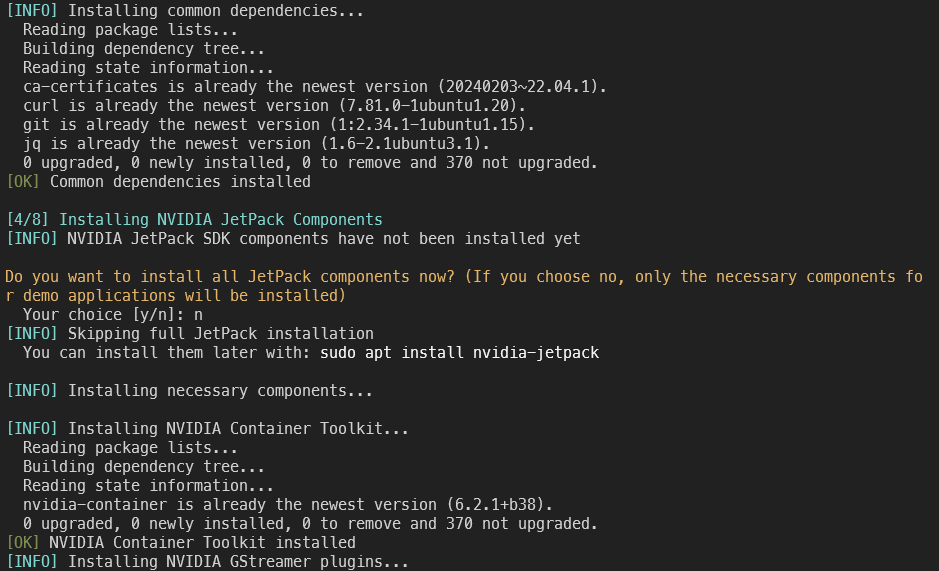
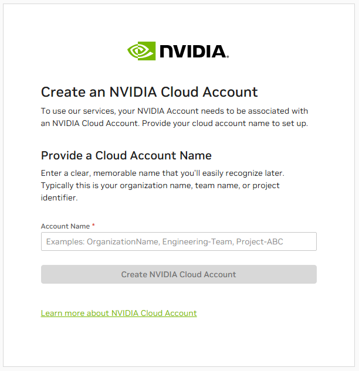
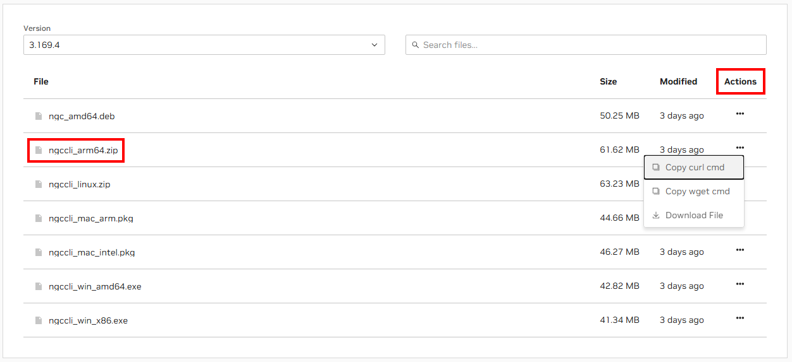
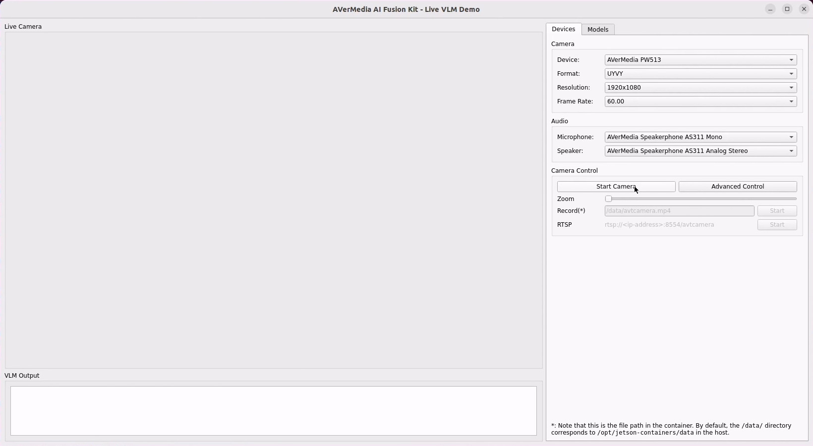
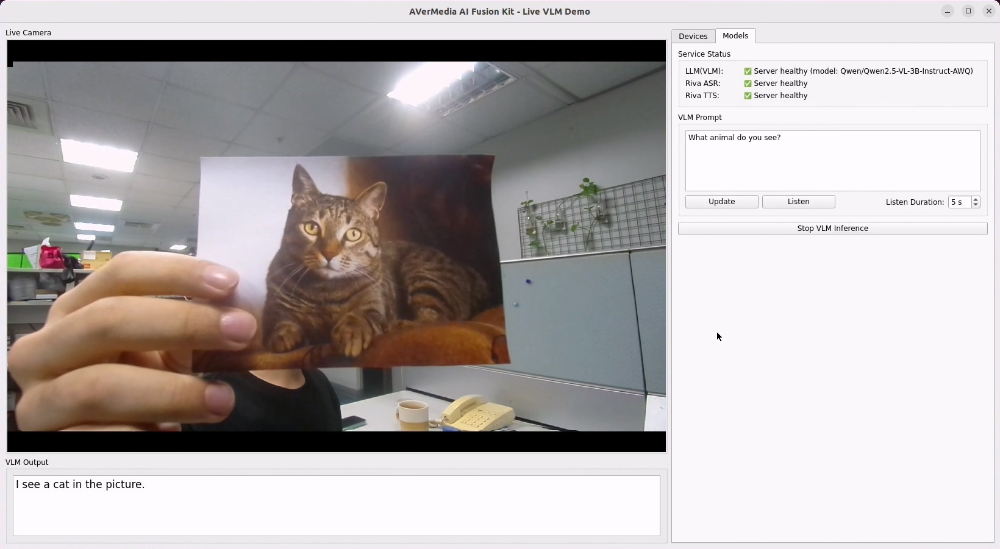

# AI Fusion Kit Quick Start

AVerMedia AI Fusion Kit is an all-in-one solution for LLM/VLM developers, which consists of:

- A powerful AI box PC (equipped with NVIDIA Jetson AGX Orin 32 GB or Orin NX 16 GB)
- A 4K camera
- An AI speakerphone

It allows you to easily build your own multimodal AI applications. This repository contains the quick start guide and scripts to help you get started with the AI Fusion Kit.

> [!NOTE]
>
> If not explicitly mentioned, all the commands are expected to be run on the box PC (the Jetson device).

## Run the Setup Script

The AI Fusion Kit comes with a pre-installed NVIDIA Jetson Linux (L4T 36.4.3 or L4T 36.4.4) operating system, based on Ubuntu 22.04 LTS. You can directly use the GUI by connecting keyboard, mouse, and monitor to the box PC, or you can also get access to the box PC via SSH if you prefer a headless setup.

To quickly get started, we recommend that you download our quick start scripts from this repository:

```bash
git clone https://github.com/AVerMedia-Technologies-Inc/ai-fusion-kit-quick-start.git
cd ai-fusion-kit-quick-start
```

In the directory, you will find the following files:

- `setup.sh`: The setup script for the AI Fusion Kit.
- `run_demo.sh`: The convenience script to run the demo applications with Docker Compose.
- `stop_demo.sh`: The convenience script to stop the demo applications.
- `compose.yaml`: The Docker Compose file for the demo applications.

We will first focus on the setup script, which automates the setup process for you, including:

- Configure the NVIDIA Jetson power mode to the best performance (MAXN or MAXN Super)
- Configure udev rules for the AVerMedia HID devices
- Install NVIDIA JetPack SDK components (full or necessary components)
- Install Docker and Docker Compose
- Install [`jetson-containers`](https://github.com/dusty-nv/jetson-containers/)
- Install AI Fusion Kit demo applications (optional)

All these steps can be done with a single command:

```bash
sudo ./setup.sh
```

Although the script completes most of the setup work automatically, it will prompt you to make some choices. Please follow the instructions to complete the setup.



> Figure: The setup script will prompt you to make some choices.

## Install NVIDIA Riva (Optional)

NVIDIA Riva is a GPU-accelerated SDK for speech AI applications. With Riva microservice containers, developers can easily integrate features like ASR and TTS into their applications. Although AI Fusion Kit demo applications can definitely work without Riva, installing Riva will unlock the full power of them, enabling the speech AI features.

NVIDIA Riva SDK is hosted on NVIDIA GPU Cloud (NGC), which requires a NVIDIA Cloud Account (NCA) to access. Therefore, we are not able to install it for you, but we will guide you through the process.

> [!IMPORTANT]
>
> At the time of writing (`2025-09-01`), NVIDIA Developer Program provides free access to NVIDIA Riva software for non-production purposes including internal evaluation, development, and testing. However, both the access to Riva and the process of getting access to Riva might change over time. Please refer to the official documentation for the latest information.
>
> - [NVIDIA Riva User Guide](https://docs.nvidia.com/deeplearning/riva/user-guide/docs/overview.html)
> - [NGC User Guide](https://docs.nvidia.com/ngc/gpu-cloud/ngc-user-guide/index.html)
> - [NCA User Guide](https://cloudaccounts.nvidia.com/docs/userguide)

### Create/Get your NVIDIA Cloud Account

NCA is NVIDIA's system for managing how different people in an organization access NVIDIA cloud services. However, individual users can also create a NCA to access NGC.

<details>
<summary>For individual users</summary>

1.  Go to [NGC Catalog](https://catalog.ngc.nvidia.com/)
2.  Click on "Sign In / Sign Up" in the menu at the top right corner
3.  Sign in or create your NVIDIA account
4.  The website will ask you to create a NCA. Feel free to name it as you want.

    

    > Figure: Creating page for NCA

5.  If you just created a new NVIDIA account, you might be asked to fill in your personal information.

</details>

<details>
<summary>For companies/organizations with NCA</summary>

Please contact the administrator of your organization's NCA. They should be able to add you to the NCA. For how to add users to an NCA, please refer to the [NGC User Guide](https://docs.nvidia.com/ngc/gpu-cloud/ngc-user-guide/index.html#ngc-adding-users).

</details>

### Install NGC CLI to Jetson

NGC CLI is a command-line tool that allows you to access NGC resources. It is the recommended way to install Riva.

#### Download NGC CLI

1.  Go to the [NGC CLI Download Page](https://catalog.ngc.nvidia.com/orgs/nvidia/teams/ngc-apps/resources/ngc_cli/files).

    > If the link is not working, you can search for "NGC CLI" in the [NGC Catalog](https://catalog.ngc.nvidia.com/).

2.  Find the `arm64` Linux version of NGC CLI. The file name should be like `ngccli_arm64.zip`.

3.  Click the "..." button in the "Actions" column and copy the `curl` or `wget` command.

    

    > Figure: Get the download command for NGC CLI from NGC Catalog

4.  Download the NGC CLI by running the command on the box PC. For example:

    ```bash
    cd ~/Downloads
    # Run the curl or wget command you get here
    curl -L 'https://api.ngc.nvidia.com/v2/resources/org/nvidia/team/ngc-apps/ngc_cli/3.169.4/files?redirect=true&path=ngccli_arm64.zip' -o 'ngccli_arm64.zip'
    ```

5.  Unzip and install the NGC CLI package to the desired location like, for example, `/opt`, and then add the installation location to your `PATH` environment variable.

    ```bash
    # Unzip and install the package
    unzip ngccli_arm64.zip
    sudo mv ngc-cli /opt/

    # Add the installation location to the PATH environment variable
    cat <<EOF >> ~/.bashrc

    # NGC CLI
    export PATH=/opt/ngc-cli:\$PATH
    EOF
    source ~/.bashrc
    ```

6.  Test if the installation is successful.

    ```bash
    ngc --version
    ```

    You should see the version of NGC CLI like this:

    ```
    NGC CLI 3.169.4
    ```

#### Set up NGC CLI

> [!NOTE]
>
> You can also refer to the [NGC User Guide](https://docs.nvidia.com/ngc/gpu-cloud/ngc-user-guide/index.html#generating-personal-api-key) for the detailed instructions with screenshots.

To make the NGC CLI work, you need to set up the authentication.

1.  Go to [NGC Catalog](https://catalog.ngc.nvidia.com/), sign in, and click "Setup" in the menu at the top right corner
2.  In the "Setup" page, click "Generate API Key".
3.  In the "API Keys" page, click "Generate API Key" and generate a new API key (or use an existing one). Note that the key permissions should include "NGC Catalog".
4.  Run the following command on your Jetson device:

    ```bash
    ngc config set
    ```

    Follow the instructions of NGC CLI to finish the setup. It will ask for the API key, organization name, etc. (The organization name might be an auto-generated long number. NGC CLI will provide possible choices in the prompt, so you can just copy and paste it.)

### Install NVIDIA Riva

Here we use version `2.19.0` (the latest version at the time of writing) of NVIDIA Riva as an example.

1.  Download the quick start scripts. You can download it to the home directory to avoid permission issues.

    ```bash
    cd ~
    ngc registry resource download-version nvidia/riva/riva_quickstart_arm64:2.19.0
    ```

2.  Take a look at the `config.sh` file in the `riva_quickstart_arm64_v2.19.0` directory and modify the configuration if needed.

    By default, the ASR and TTS services are enabled for the `en-US` language, and the models will be stored in `riva_quickstart_arm64_v2.19.0/model_repository`.

3.  Enter the `riva_quickstart_arm64_v2.19.0` directory, run the `riva_init.sh` script to install the Riva containers and models. After the script finishes, you should be able to start the Riva services by running the `riva_start.sh` script.

    ```bash
    cd riva_quickstart_arm64_v2.19.0
    bash riva_init.sh
    bash riva_start.sh
    ```

4.  By default, the `riva_start.sh` script will open a terminal inside the container for you to test the Riva services. However, the example scripts inside may not function as expected on Jetson. For Python examples, we recommend you to run the `riva-client:python` container provided by `jetson-containers`. See [Jetson Containers](#jetson-containers) section for more details.

## Run the Demo Applications

> [!WARNING]
>
> The AI speakerphone is equipped with a nice echo cancellation feature. However, the algorithm will only work after a few seconds of sound has been played from the speakerphone. Therefore, you may need to play some sound before running the demo, or the speech AI may hear itself.

Currently, only one demo application is available for the AI Fusion Kit. It is a multi-container application that consists of:

- A ***local*** [vLLM](https://github.com/vllm-project/vllm) server for LLM/VLM inference
- (Optional) A ***local*** NVIDIA Riva server providing ASR and TTS services
- A GUI application built with AVerMedia software stack, handling the multimedia stream and providing the user interface

If you have chosen to install the demo applications during the setup process, the containers and the VLM model (by default, `Qwen/Qwen2.5-VL-3B-Instruct-AWQ`) should have been installed automatically. You can easily run the demo application by running the following command:

```bash
cd /path/to/ai-fusion-kit-quick-start
./run_demo.sh
```

<details>
<summary>What does the <code>run_demo.sh</code> script do?</summary>

If you take a look at the script, you will find that it basically does the following:

- Detect the video devices and HID devices connected to the box PC
- Find the installation path of `jetson-containers`, which should contain the VLM model
- Find the installation path of Riva models
- Write the above information to the `compose.override.yml` or the `.env` files
- Start the containers with Docker Compose

</details>

The GUI application should launch shortly. You will find the live camera feed and the VLM output in the left column, with various configuration controls in the right column.



> Figure: In the "Devices" tab, you can select the video and audio devices and start the camera.

The AI features are placed in the "Models" tab. Here you can check the status of the AI microservices, set the VLM prompt, and start the VLM inference. It is a live image captioning application, which will describe the live camera feed in real time. Typically, it takes several minutes for vLLM to start the server, so you will have to wait for a while before you see the LLM service healthy.

The prompt is usually a question for the model to answer based on the live camera feed. You can update the prompt at any time, either by typing or speaking, even while the inference is running.

<details open>
<summary>Update the prompt by typing</summary>

1.  Type the prompt in the text box
2.  Click the "Update" button for the prompt to take effect

</details>

<details>
<summary>Update the prompt by speaking</summary>

> [!WARNING]
>
> NVIDIA Riva is required for the speech AI features. You will not be able to click the "Listen" button if you have not installed Riva.

1.  Click the "Listen" button, and you should hear the speech AI saying "I'm listening..."
2.  Speak the prompt
3.  The speech AI will repeat the prompt back to you and automatically update the prompt (you don't need to click the "Update" button)

</details>



> Figure: In the "Models" tab, you can check the status of the AI microservices and control the inference. The live camera feed and the VLM output are displayed in the left.

## More Development Resources

### Jetson Containers

[jetson-containers](https://github.com/dusty-nv/jetson-containers) is a great open-source project for Jetson developers. It provides a set of pre-built Docker images for Jetson devices on [Docker Hub](https://hub.docker.com/u/dustynv), and tools to help you build the images you need. These images are built for general development purposes, so typically they are big in size and contain many tools, whether you need them or not. We **highly encourage** you to use the actively maintained images provided by `jetson-containers` in the early stage of your development, like `dustynv/vllm`, `dustynv/ollama`, etc., for they save you a lot of time, especially if you are not familiar with either NVIDIA Jetson or Docker.

Actually, the demo application is also built with `dustynv/vllm`, a pre-built image for [vLLM](https://github.com/vllm-project/vllm). You can also directly run the container without launching the demo application. For example, you can start the vLLM server (serving OpenAI-compatible API) by running the following command:

```bash
jetson-containers run $(autotag vllm) vllm serve Qwen/Qwen2.5-VL-3B-Instruct-AWQ \
    --host=0.0.0.0 \
    --port=9000 \
    --max-num-seqs 1 \
    --disable-mm-preprocessor-cache \
    --trust-remote-code \
    --max-model-len=2048 \
    --gpu-memory-utilization=0.35 \
    --limit-mm-per-prompt='{"image":1,"video":0}' \
    --mm-processor-kwargs='{"max_pixels":200704,"size":{"shortest_edge":3136,"longest_edge":200704}}' \
    --uvicorn-log-level=debug
```

`jetson-containers` will handle all the options you need to pass to `docker run` for you, and `autotag` is a tool provided by `jetson-containers` to help you find the latest image tag on your device.

After the server is ready, you can test it by either sending a request with `curl` or using the `openai` Python package. It takes a while for the first inference of the server to finish, but the subsequent inferences should be much faster.

<details open>
<summary>Send a request with <code>curl</code></summary>

Example provided by Jetson AI Lab.

```bash
curl http://0.0.0.0:9000/v1/chat/completions \
-H "Content-Type: application/json" \
-d '{
    "messages": [{
    "role": "user",
    "content": [{
        "type": "text",
        "text": "What is in this image?"
    },
    {
        "type": "image_url",
        "image_url": {
        "url": "https://upload.wikimedia.org/wikipedia/commons/thumb/d/dd/Gfp-wisconsin-madison-the-nature-boardwalk.jpg/2560px-Gfp-wisconsin-madison-the-nature-boardwalk.jpg"
        }
    }
    ]}],
    "max_tokens": 300
}'
```

</details>

<details>
<summary>Use the <code>openai</code> Python package</summary>

The `openai` Python package is a popular library for interacting with OpenAI API. Again, the following example is provided by Jetson AI Lab.

```python
import base64
import requests

import openai

client = openai.OpenAI(
    base_url='http://0.0.0.0:9000/v1',
    api_key='dummy', # Local server doesn't require an API key
)

models = [model.id for model in client.models.list()]
print(f"Models from server {client.base_url}: {models}")

url = "https://raw.githubusercontent.com/dusty-nv/jetson-containers/refs/heads/dev/data/images/dogs.jpg"
txt = "What kind of dogs are these?"  # the image shows a husky and golden retriever
img = requests.get(url)

messages = [{
    'role': 'user',
    'content': [
        { 'type': 'text', 'text': txt },
        {
            'type': 'image_url',
            'image_url': {
                'url': 'data:' + img.headers['Content-Type'] + ';' + 'base64,' + base64.b64encode(img.content).decode()
            },
        },
    ],
}]

stream = client.chat.completions.create(
    model=models[0],
    messages=messages,
    stream=True
)

for chunk in stream:
    print(chunk.choices[0].delta.content, end='', flush=True)
print()
```

</details>

### Jetson AI Lab

> [!WARNING]
>
> Some examples in Jetson AI Lab are problematic and not working as expected at the moment. We are planning to provide the known issues in the future.

[Jetson AI Lab](https://www.jetson-ai-lab.com/index.html) is a great website for Jetson developers, providing rich examples and tutorials. Nevertheless, the examples and tutorials are not actively maintained at the moment, and one of the main contributors of `jetson-containers` [has stated that the examples are outdated (on Jun 27, 2025)](https://github.com/dusty-nv/jetson-containers/issues/1150#issuecomment-3012980135).

Many examples in Jetson AI Lab are based on the [NanoLLM](https://github.com/dusty-nv/NanoLLM) library, which is also inactive now. Therefore, we recommend you to use other popular third-party libraries instead, like [vLLM](https://github.com/vllm-project/vllm), [Ollama](https://github.com/ollama/ollama), [SGLang](https://github.com/sgl-project/sglang), etc. The [model cards](https://www.jetson-ai-lab.com/models.html) in Jetson AI Lab can still help a lot for you to run VLM models with vLLM or Ollama, but you'll have to be careful that the default model saving location (the "Cache Dir" option in the card) is different from the `jetson-containers`.
